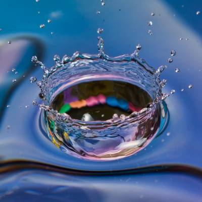
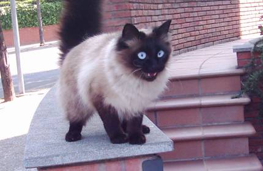

# Metaprogramming an Image Retriever

Ruby allows you to modify and extend its functionality. This is particularly nice if you want to abstract away implementation details into concise, human-readable methods. The Rails framework does this by allowing the developer to generate code with a simple and concise commands. For example, a model, migration, controller with crud methods, and routes and views to go along with each method can all be generated with the command:

```bash
rails generate scaffold ResourceName
```

The Image Retriever is a bit more contrived than the rails application, but it demonstrates how metaprogramming can be used to generate files with a function call that has all the information needed in the name of the function. And we don't even explicitly create the function that is called.

```ruby
require_relative 'user'

# First we have the User class. Our first modification to the class happens
# right when we instantiate it by extending it with the GravatarGenerator
# module. This module adds a class method callback that extends the User class
# with a method_missing method. This method lets the user try any function they
# want, and if it matches a pattern defined in the method missing method, then
# it is handled accordingly.
phil = User.new('Phil') # => Extending User with GravatarGenerator
phil.name # => 'Phil'

# That method_missing method gives the user the ability to dynamically unlock
# specific image generators. If the user tries to generate an image before
# they've chosen a generator, they'll run into trouble, because the matching
# functionality doesn't exist yet for that pattern.
phil.generate_nature_400x400
# => NoMethodError: undefined method `generate_nature_400x400' for
#    #<User:0x007ffafaf21208 @name="Phil">

# Unlocking an image generator further extends the User class
phil.unlock_lorem_pixel # => Including LoremPixel

# Now the User has inherited the LoremPixel method_missing functionality, and
# can make requests to the LoremPixel service.
phil.generate_nature_400x400
```


```ruby
# Simply changing the method name creates a unique http request, which fetches a
# different image, and stores that image with a different filename.
phil.generate_animals_430x280
```


```ruby
# And if the user wants to be able to generate images from a different source,
# they can change their method missing behavior by unlocking a different image
# generator.
phil.unlock_fill_murray # => Including FillMurray
phil.generate_fill_284x196
```

